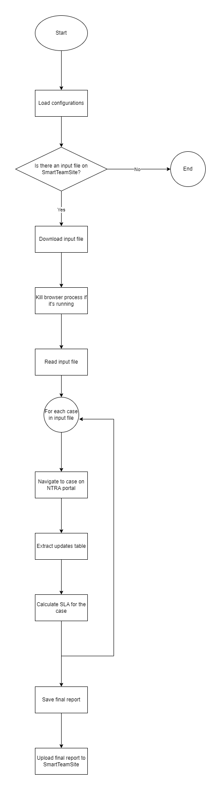

[![LinkedIn][linkedin-shield]][linkedin-url]

<!-- PROJECT LOGO -->
 

  
  <h3 align="center">NTRA SLA Validation Automation Robot</h3>

<!-- TABLE OF CONTENTS -->

  
Table of Contents

  <ol>
    <li>
      <a href="#about-the-project">About The Project</a>
      <ul>
        <li><a href="#business-case">Business Case</a></li>
        <li><a href="#technical-solution">Technical Solution</a></li>
        <li><a href="#flowchart">Flowchart</a></li>
        <li><a href="#tech-stack">Tech Stack</a></li>
      </ul>
    </li>
    <li><a href="#contact">Contact</a></li>
  </ol>

<!-- ABOUT THE PROJECT -->
## About The Project

* Project Name: NTRA SLA Validation Automation Robot
* Version: v1.0.8
* Organization Department: Technology

### Business Case

In managing fraud cases, compliance with Service Level Agreements (SLAs) is crucial to maintaining a positive relationship with regulatory bodies and avoiding penalties. This project automates the process of validating SLAs for fraud complaints that were received and handled over the past month. Each month, the regulatory authority (NTRA) provides a report with their calculations of SLA compliance. The challenge is to validate these figures against internal data to ensure accuracy and avoid any discrepancies that could lead to performance penalties.

The NTRA SLA Validation Automation robot helps streamline this process by ensuring timely, precise SLA calculations, allowing the organization to avoid potential fines and provide accurate feedback for performance assessments.

(<a href="#readme-top">back to top</a>)

### Technical Solution

This automation runs every 30 minutes and carries out the following tasks:

1. File Check and Download: The robot checks for the presence of the monthly input file in the designated SmartTeamSite folder. Once detected, the file is automatically downloaded for processing.

2. Case Analysis: For each case listed in the file:
   * The robot accesses the URL of each fraud complaint case.
   * Extracts the update history and calculates the total SLA time for each case based on the extracted data.

3. Report Generation: After validation, the robot compiles a final report of SLA calculations for all cases and exports this into an Excel sheet.

4. Automated Upload: Once the report is generated, it is automatically uploaded back to the SmartTeamSite folder for review.

This automation eliminates the need for manual validation, ensuring higher accuracy and saving significant time in SLA compliance reporting. By automating the validation process, the business can ensure that SLAs are consistently met and reported without errors.

(<a href="#readme-top">back to top</a>)

### Flowchart

(<a href="#readme-top">back to top</a>)

### Tech Stack

This project was developed using the following tech stack:

* UiPath
* Python

(<a href="#readme-top">back to top</a>)

<!-- CONTACT -->
## Contact

Mohamed AbdelGawad Ibrahim - [@m-abdelgawad](https://www.linkedin.com/in/m-abdelgawad/) - <a href="tel:+201069052620">+201069052620</a>

(<a href="#readme-top">back to top</a>)

<!-- MARKDOWN LINKS & IMAGES -->
[linkedin-shield]: https://img.shields.io/badge/-LinkedIn-black.svg?style=for-the-badge&logo=linkedin&colorB=555
[linkedin-url]: https://www.linkedin.com/in/m-abdelgawad/
